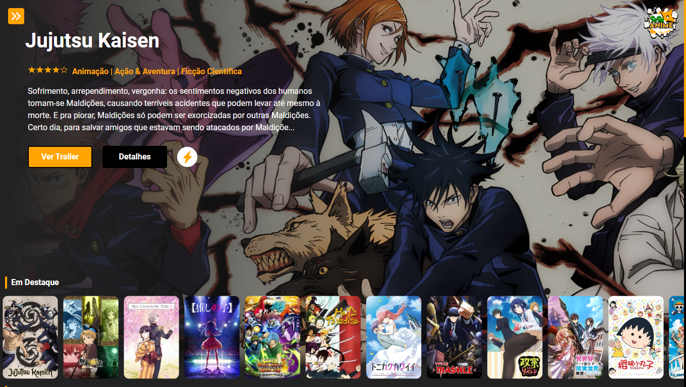

# Sosa Animes - Seu Guia Definitivo de Animes! 🌟🎬

## Visão Geral
Bem-vindo ao Sosa Animes, o portal definitivo para os amantes de Animes! Este projeto foi desenvolvido com paixão e dedicação para proporcionar uma experiência emocionante e cativante aos entusiastas de animações japonesas. Aqui você encontrará uma vasta coleção de listas de Animes, trailers eletrizantes e a possibilidade de salvar seus títulos favoritos. Vamos juntos embarcar em uma jornada pelo universo animado?

## Principais Recursos
- 100% Traduzido em Inglês e Português
- Páginas detalhadas de cada Anime: Explore os detalhes fascinantes de cada Anime, conheça os personagens e mergulhe em tramas envolventes.
- Trailers empolgantes: Sinta a adrenalina e emoção de cada Anime antes de assisti-los.
- Lista de Favoritos: Guarde seus Animes preferidos e acesse-os facilmente sempre que quiser.
- Filtros Inteligentes: Encontre Animes por gênero, relevância, nota ou lançamento e descubra novos tesouros animados.
- Responsivo para dispositivos móveis: Leve o mundo dos Animes no bolso e desfrute da experiência em qualquer lugar.

## Tecnologias Utilizadas
- NextJs com typescript para uma experiência de usuário ágil e responsiva.
- Firebase para gerenciamento seguro de login e armazenamento dos favoritos dos usuários.
- API do TMDB para enriquecer o catálogo com informações precisas e atualizadas.

## Como Contribuir
Sua contribuição é mais que bem-vinda! Se você é um entusiasta de Animes ou desenvolvedor interessado em aprimorar o projeto, siga os passos abaixo:
1. Faça um Fork deste repositório.
2. Crie uma branch com sua feature (`git checkout -b minha-feature`).
3. Faça commit das alterações (`git commit -m 'Adicionar minha-feature'`).
4. Faça um push para a branch (`git push origin minha-feature`).
5. Abra um Pull Request.

## Instalação e Execução
1. Clone este repositório em sua máquina local.
2. Instale as dependências do projeto com `npm install`.
3. Configure as credenciais do Firebase no arquivo de configuração (`firebaseConfig.tsx`).
4. Configure suas variaveis local.env
5. Execute o servidor de desenvolvimento com `npm run dev`.
6. Acesse o aplicativo em `http://localhost:3000`.

## Sobre o Autor
Olá! Meu nome é [Seu Nome], sou apaixonado por Animes e desenvolvimento web. O Sosa Animes foi criado como um projeto pessoal de aprendizado e paixão. Espero que você se divirta navegando no Sosa Animes tanto quanto eu me diverti construindo-o. Caso queira me contatar ou saber mais sobre meus projetos, não hesite em me encontrar no LinkedIn ou em meu site pessoal.

---

Vamos juntos explorar o fascinante mundo dos Animes? Acesse agora mesmo o Sosa Animes e viva emoções que vão além da imaginação! 🔗 [Inserir link do site]

#SosaAnimes #Animes #NextJs #Firebase #TMDB #DesenvolvimentoWeb #PaixãoPorAnimes #Trailers #Favoritos #ExperiênciaDoUsuário #Responsividade #Inovação #MaratonaDeAnimes #GitHub #DesenvolvedorWeb
